# Installation de git

- [Installation de git](#installation-de-git)
  - [Vérifier le nom de votre ordinateur](#vérifier-le-nom-de-votre-ordinateur)
    - [Windows](#windows)
    - [Linux / MacOS](#linux--macos)
  - [Créer un compte en ligne](#créer-un-compte-en-ligne)
  - [Installer Visual Studio Code ou VSCodium](#installer-visual-studio-code-ou-vscodium)
  - [Installation de Git Sous Windows](#installation-de-git-sous-windows)
    - [Configurer l'explorateur de fichiers](#configurer-lexplorateur-de-fichiers)
    - [Installation de Windows Terminal](#installation-de-windows-terminal)
    - [Autoriser la création de liens symboliques](#autoriser-la-création-de-liens-symboliques)
    - [Installation du client OpenSSH](#installation-du-client-openssh)
      - [Client OpenSSH : Interface graphique](#client-openssh--interface-graphique)
      - [Client OpenSSH : Powershell](#client-openssh--powershell)
    - [Client git : téléchargement et installation](#client-git--téléchargement-et-installation)
  - [Installation de Git sous Linux / macOS](#installation-de-git-sous-linux--macos)
  - [Configuration (bash ou git bash)](#configuration-bash-ou-git-bash)
    - [Ignorer des fichiers pour tous les projets](#ignorer-des-fichiers-pour-tous-les-projets)
    - [Configuration du nom d'utilisateur et courriel](#configuration-du-nom-dutilisateur-et-courriel)
    - [Vérification code ou codium](#vérification-code-ou-codium)
    - [Configurations générales](#configurations-générales)
    - [Éditeur (`diff` et `merge`) par défaut](#éditeur-diff-et-merge-par-défaut)
    - [Vérification : configuration système, utilisateur et projet](#vérification--configuration-système-utilisateur-et-projet)

## Vérifier le nom de votre ordinateur

### Windows

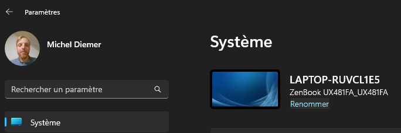

En Powershell :

```powershell
# Administrateur
hostname
[System.Net.Dns]::GetHostName()
Rename-Computer -NewName "PC-MICHELD"

# Redémarrer l'ordinateur si nécessaure
Restart-Computer
```

### Linux / MacOS

En ligne de commande : `hostname`

Renommer si nécessaire

## Créer un compte en ligne

Aller sur [https://github.com/downloads](https://github.com) et créer un compte en ligne

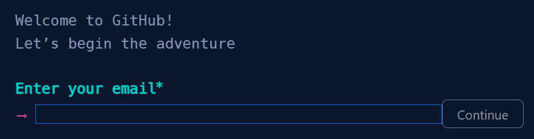

Alternatives possibles :

- Framasoft (philosophie libre) [Framagit](https://framagit.org/public/projects)
- [GitLab](https://about.gitlab.com/)
- [Bitbucket](https://bitbucket.org/)
- [SourceForge](https://sourceforge.net/)

## Installer Visual Studio Code ou VSCodium

Télécharger et installer `Visual Studio Code` (pas totalement Open Source) ou `VSCodium` (100% Open Source):

- [VSCodium](https://vscodium.com)
- [Visual Studio Code](https://code.visualstudio.com)

`Épingler à la barre des tâches`

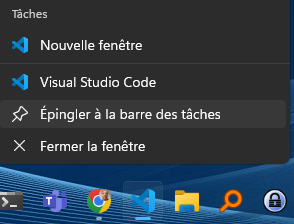

## Installation de Git Sous Windows

### Configurer l'explorateur de fichiers

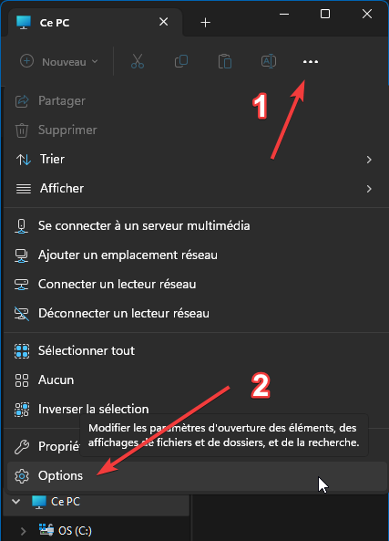

- [x] Afficher les fichiers, dossiers et lecteurs cachés
- [ ] Masquer les extensions des fichiers dont le type est connu

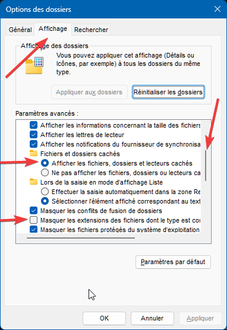

### Installation de Windows Terminal

Si ce n'est pas déjà fait, télécharger et installer l'application `Windows Terminal` depuis le `Microsoft Store` et `Épingler à la barre des tâches`

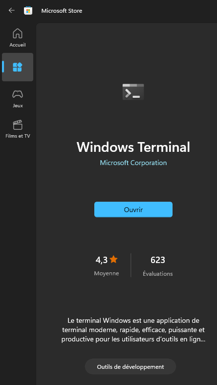

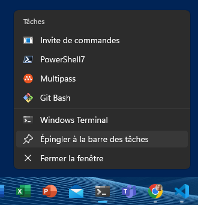

Astuce : pour démarrer `Powershell` ou n’importe que programme en mode `Administrateur`, `Ctrl` + `Shift` + `Clic` sur l'icône ou le programme concerné.

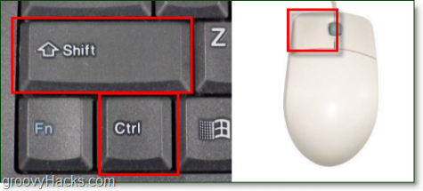

### Autoriser la création de liens symboliques

Ouvrir l'éditeur de stratégie de sécurité locale

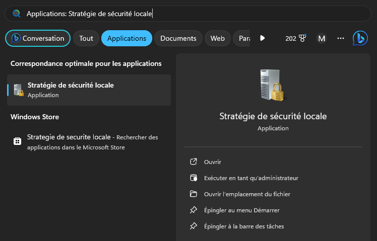

Dans `Paramètres de sécurité\Stratégies locales\Attribution des droits d'utilisateur` :

| Stratégie                   |  Paramètre de sécurité |
| --------------------------- | ---------------------- |
| Créer des liens symboliques | Administrateurs…       |

Ajouter `Utilisateurs authentifiés` (ou alors vous-même)

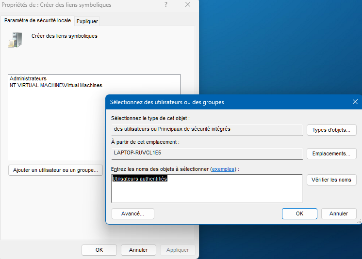

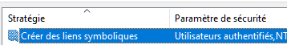

### Installation du client OpenSSH

#### Client OpenSSH : Interface graphique

Dans `Paramètres`, `Applications`, `Fonctionnalités facultatives`

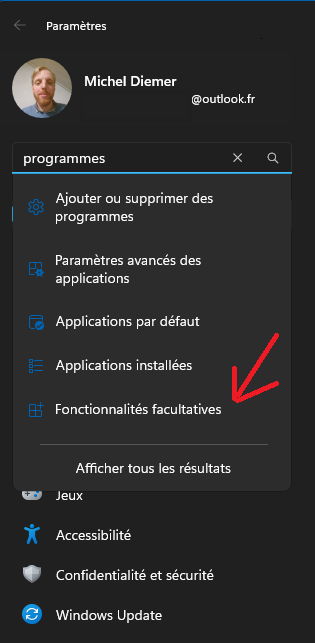

Cliquer sur `Afficher les fonctionnalités`

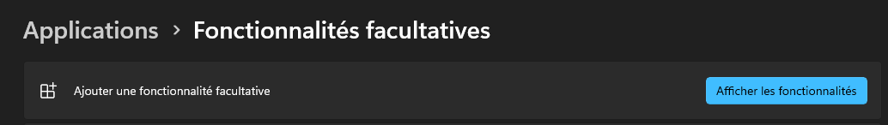

Cocher `Client OpenSSH` et cliquer sur `Suivant`

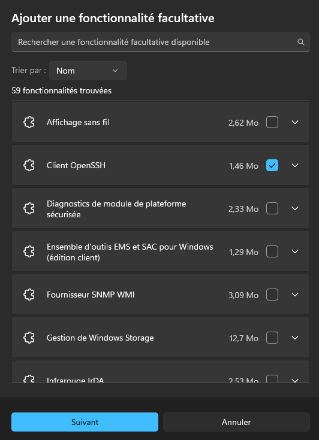

Cliquer sur `Installer`

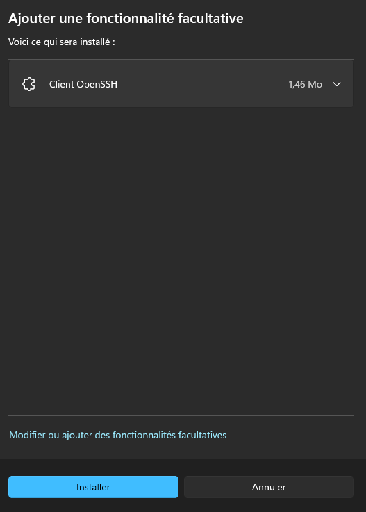

#### Client OpenSSH : Powershell

En mode Administrateur

```powershell
# En tant qu'administrateur
Get-WindowsCapability -Online | Where-Object Name -like 'OpenSSH*'
Add-WindowsCapability -Online -Name OpenSSH.Client
```

### Client git : téléchargement et installation

Télécharger la dernière version de l'installateur 64-bit depuis [https://git-scm.com/download/win](https://git-scm.com/download/win)


Cocher les options, surtout `Add Git Bash Profile to Windows Terminal`

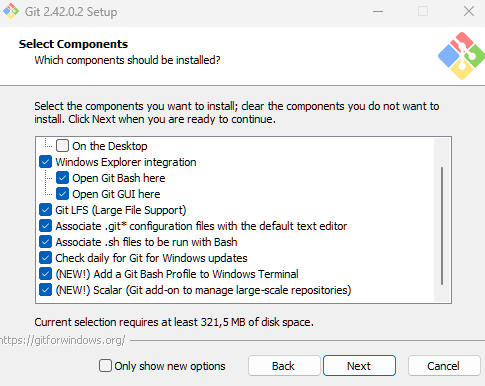

Changer l’éditeur par défaut

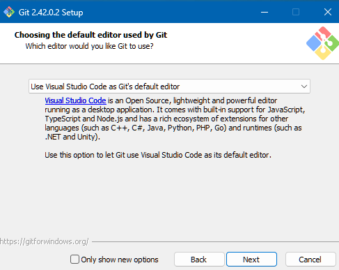

Changer le nom de la branche

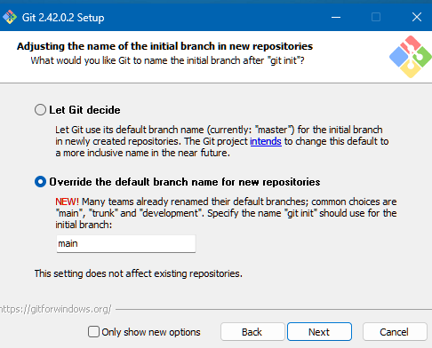

Autoriser les programmes Unix optionnels. Attention aux programmes `find` et `sort`

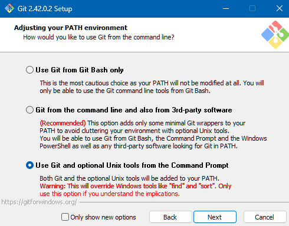

Utiliser `OpenSSH` de Windows

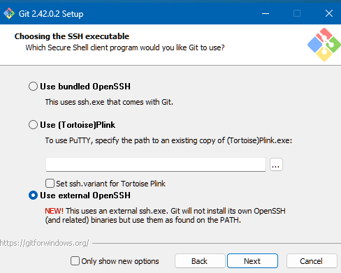

Cocher `Use the native Windows Secure Channel library` (pas très important à notre niveau)

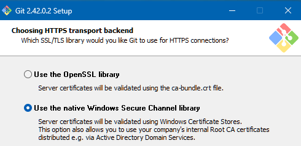

Cocher l’option `commit Unix-style line endings`

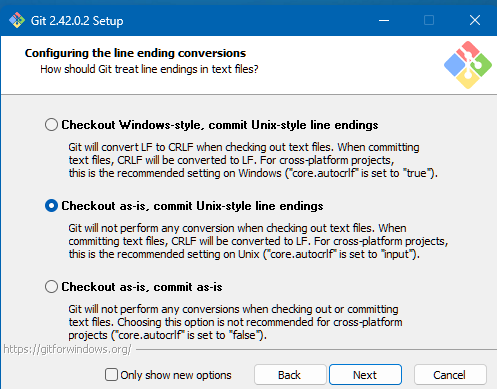

Au choix :

- [ ] `MinTTY` ouvre une nouvelle fenêtre pour `Git Bash`. Avantage : meilleur support de `Unicode`. Inconvénient : il faut lancer certains programmes avec `winpty`.

- [x] `Use Windows default console window` : utilise le terminal de Windows.

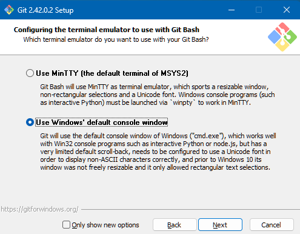

`git pull` : `Default`

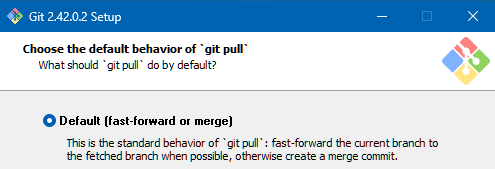

`Git Credential Manager`

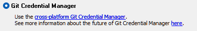

`Configuring extra options`

[X] Enable file system caching
[X] Enable symbolic links

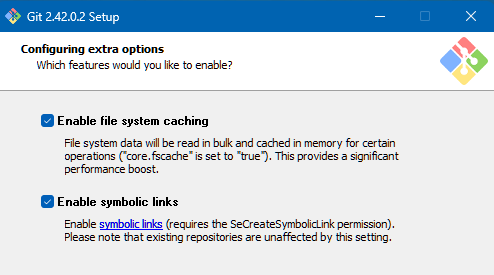

Pour les fonctionnalités expérimentales, vous pouvez les activer ou non.

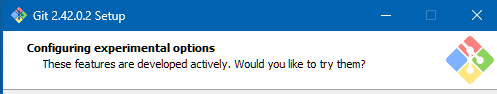

À la fin de l’installation, lancer Git Bash :

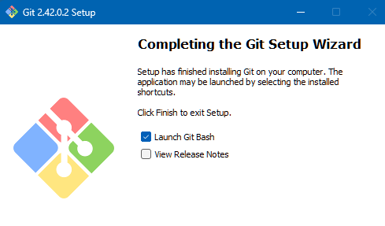

## Installation de Git sous Linux / macOS

Aller sur [https://git-scm.com/downloads](https://git-scm.com/downloads) et suivre les instructions

## Configuration (bash ou git bash)

### Ignorer des fichiers pour tous les projets

Ouvrir `git bash` ou `bash`.

`nano` est un éditeur de fichiers texte en ligne de commandes, simple et léger, sous Linux. Les commandes se font avec la touch `Ctrl` représentée par un accent circonflexe (ou encore `Échap Échap`). La touche `M` comme `Méta` c'est la touche `Alt`, `Cmd` ou `Esc` :

- `Ctrl 6` `ESC 6    ` : Copier (dans `nano`)
- `Ctrl K` `ESC ESC K` : Couper (dans `nano`)
- `Ctrl U` `ESC ESC U` : Coller (dans `nano`)
- `Ctrl S` `ESC ESC S` : Enregistrer
- `Ctrl X` `ESC ESC X` : Quitter
- `Ctrl W` `ESC ESC W` : Rechercher du texte

```bash
nano ~/.gitignore_global
```

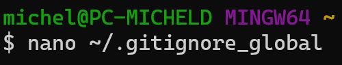

Contenu du fichier `.gitignore_global` :

```txt
*~
.*.swp
.DS_Store
desktop.ini
*.tmp
```

`Ctrl + S` : Enregistrer

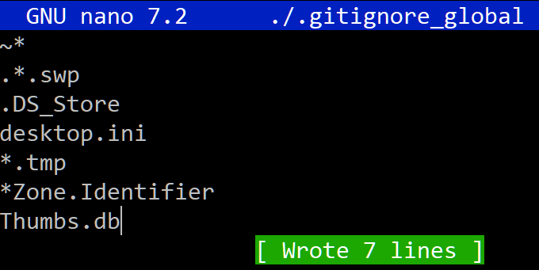

`Ctrl + X` : Quitter


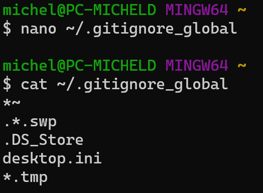

### Configuration du nom d'utilisateur et courriel

```bash
GIT_USER_NAME="votre pseudo sur git"
GIT_USER_EMAIL="votre adresse mail sur git"
CODE=code
```

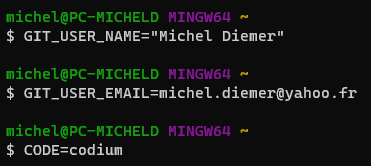

### Vérification code ou codium

```bash
(command -v $CODE) && echo -e "Program utilisé : \033[1;33m\033[46m$CODE\033[0m"
(command -V $CODE) || echo -e "\033[0;31mVSCode non installé.\033[0m"
#(command -v code) && CODE=code
#(command -v codium) && CODE=codium
#(command -v code) || echo "La commande code n'existe pas."
#(command -v codium) || echo "La commande codium n'existe pas."
#((command -v code) || (command -v codium)) && echo -e "Program utilisé : \033[1;33m\033[46m$CODE\033[0m"
#((command -v code) || (command -v codium)) || echo -e "\033[0;31mVSCode non installé.\033[0m"
```

### Configurations générales

```bash
git config --global user.email "$GIT_USER_EMAIL"
git config --global user.name "$GIT_USER_NAME"
git config --global core.eol lf
git config --global core.autocrlf false
git config --global core.excludesfile ~/.gitignore_global
git config --global core.ignorecase false
git config --global init.defaultbranch main
```

### Éditeur (`diff` et `merge`) par défaut

```bash
git config --global --replace-all core.editor "$CODE --wait"
git config --global --replace-all diff.tool vscode
git config --global --replace-all difftool.prompt false
git config --global --replace-all difftool.vscode.cmd "$CODE --wait --diff $LOCAL $REMOTE"
git config --global --replace-all merge.tool vscode
git config --global --replace-all mergetool.vscode.cmd "$CODE --wait $MERGED"
```

### Vérification : configuration système, utilisateur et projet

Fichier `~/.gitconfig`

```bash
cat ~/.gitconfig
```

```ini
[user]
        email = michel.diemer@yahoo.fr
        name = Michel Diemer
[core]
        eol = lf
        autocrlf = false
        excludesfile = C:/Users/Michel/.gitignore_global
        ignorecase = false
        editor = code --wait
[init]
        defaultbranch = main
[diff]
        tool = vscode
[difftool]
        prompt = false
[difftool "vscode"]
        cmd = code --wait --diff $LOCAL $REMOTE
[merge]
        tool = vscode
[mergetool "vscode"]
        cmd = code --wait $MERGED
```

Toutes les configurations (tous les `gitconfig`)

```bash
git config -l --show-origin
```

Configuration spécifique à un projet (dépôt git existant)

```bash
# Dans un dépôt git déjà initialsé avec git init

# Sauts de ligne Windows CRLF pour ce projet
git config core.eol crlf

# Vérification

cat .git/config

git config --local -l
```
